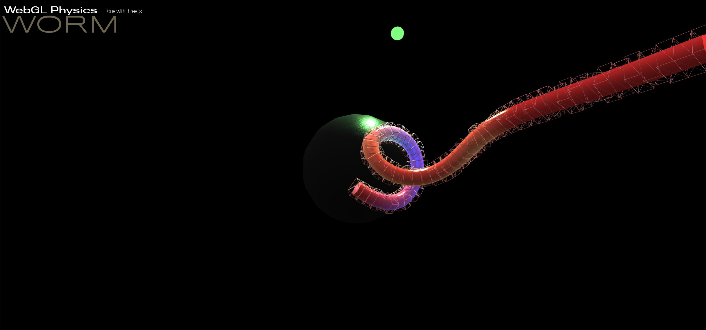

# Lightworm

Three.js + Cannon.js experiment to simulate physical worm.

## Description

This project show how to setup a physical worm using [three.js](https://threejs.org/).

## Youtube video

Check the [video](https://youtu.be/WcPohF3vnik) on youtube.
